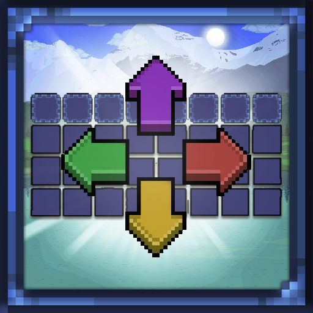

<!-- PROJECT LOGO -->
 

  

  <h3 align="center">UI Customizer</h3>

A customizable Terraria UI mod that lets you reposition, toggle, and serialize interface elements in-game with full layout and mod support.

Check it out here 👉 [Steam Workshop](<https://steamcommunity.com/sharedfiles/filedetails/?id=3491266876>)
